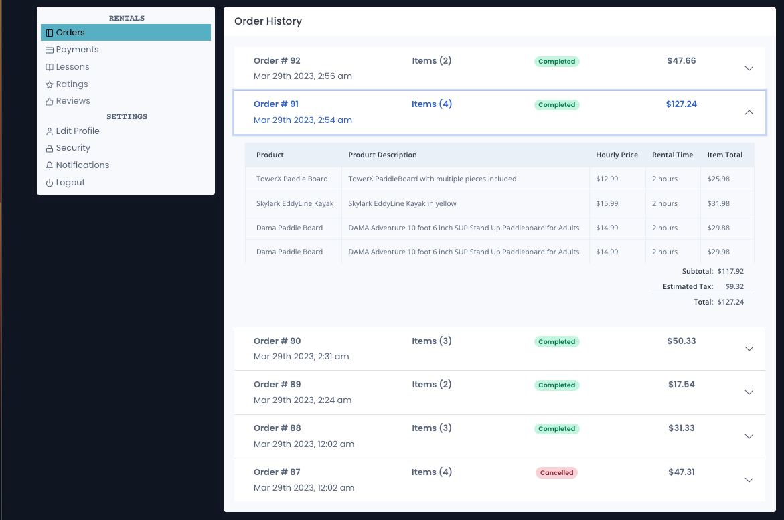

# Makai Rentals Project
Makai Rentals is a startup which focuses on watersport rentals, allowing users to pick up and drop off their purchased items at one of Makai stands which will be stocked with products from local stores. As a developer, I worked on creating the web application capable of handling all the neccassary interactions between customers, partners, and administators. Due to the proprietary nature of the code only selected, approved snippets of my code can be shared in this repository. This repository contains SQL, .NET, and ReactJS code.

One of my responsibilities at Makai Rentals was to build a profile page for the customers. On this page, a user can access their order history and their payment history.

Also on the profile page, a user can change their basic account information such as the name or phone number. When changing more secure account information as their password or email, their current password will be required and validated. All passwords will be encrypted using BCrypt and if the password is changed, then an email is sent that user indicating the change.

In addition, I built an insurance option into the checkout flow, allowing customers to select whether they want their rental to be covered by insurance for an additional fee. The application contains many features for the administrators and project owners to explore. As such, I was responsible for creating the API endpoints to handle retrieving specified business statistatics realated to user and revenue growth.

• Debug functional and logic errors during end-to-end testing with Chrome Devtools.

• Coordinate peer developers on overall design and standardization of project components and overall look.

• Document best practices and project coding standards.

• Lead daily code review sessions and productivity meetings with peer developers.

• Complete weekly pull requests to production with manager and peer reviews using GitHub.

• Conduct technical training lectures and code troubleshooting sessions with peer developers.
